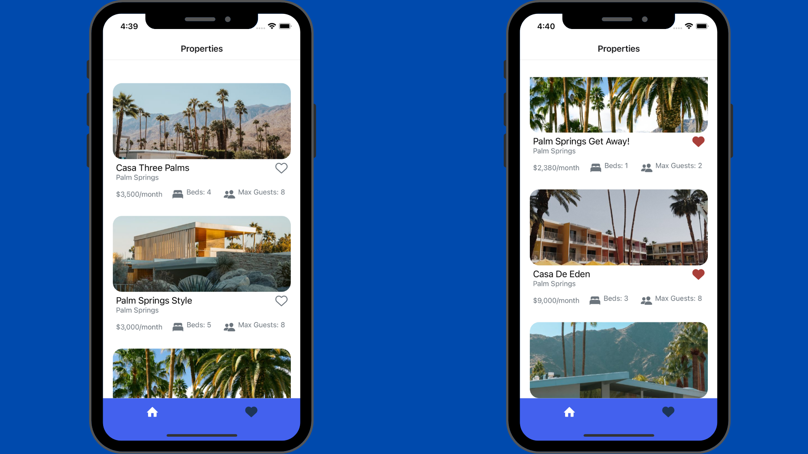
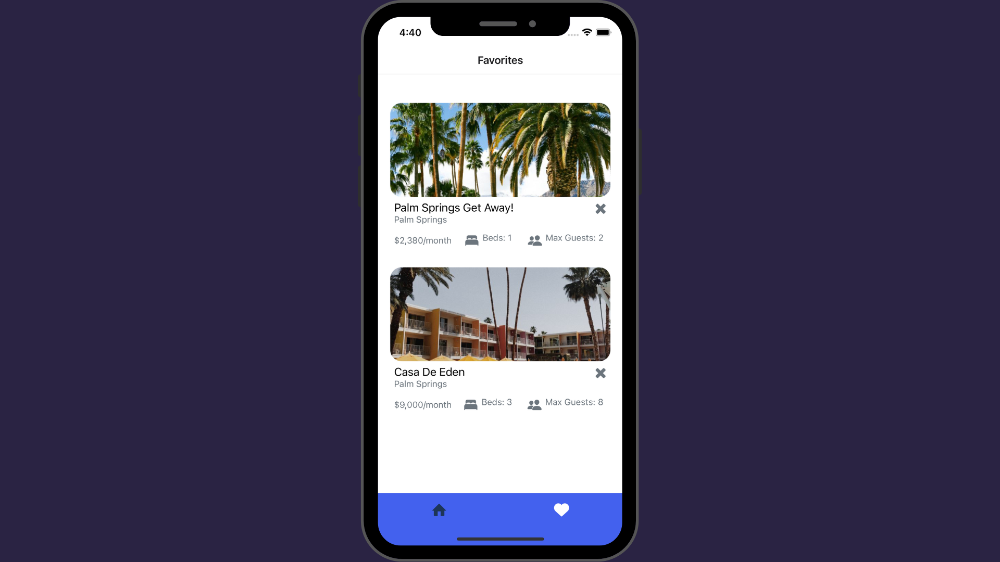

# Nice Stay - React Native App

## Table of Contents
- [Features](#features)
- [Screenshots](#screenshots)
- [Usage](#usage)
- [Contributing](#contributing)
- [Licence](#license)

## Features

- Browse and filter hotels and properties for rent or buy
- Add properties to your favorites list

## Screenshots

### Screenshot 1

### Screenshot 2

## Installation

To install the app, follow these steps:

1. Clone the repository: `git clone https://github.com/alanhcrdz/nice-stay.git`

2. Install dependencies: `npm install`

3. Run the app on a simulator or device: `npx expo start`

## Usage
Once you have the app installed, you can start browsing properties by selecting the appropriate filters. You can also save your favorite properties to easily access them later.
## Contributing

If you would like to contribute to this project, please follow these steps:

1. Fork the repository
2. Create a new branch for your feature or bug fix
3. Make your changes and commit them
4. Push your changes to your fork
5. Submit a pull request to the original repository

## License
This project is licensed under the MIT License.
